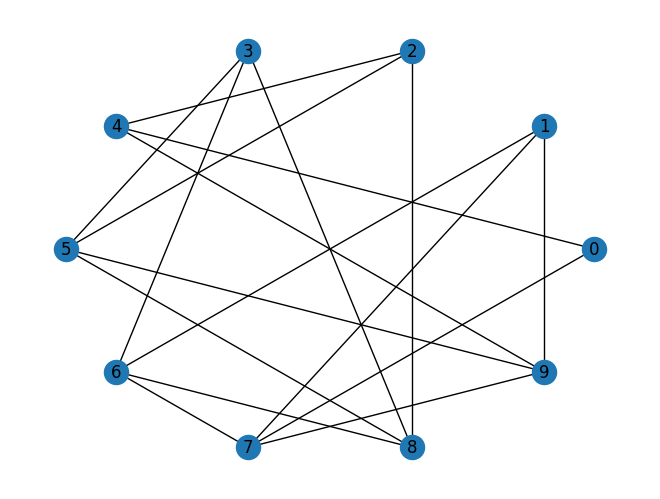
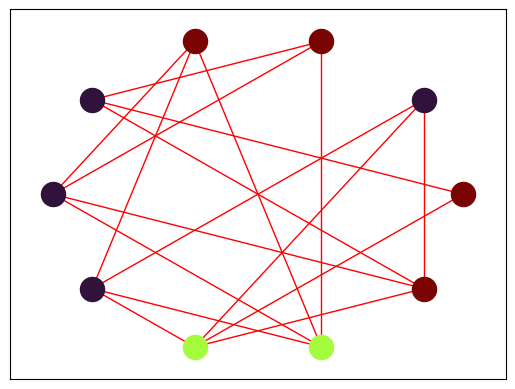

## Resumo
Este repositório reúne dois trabalhos desenvolvidos para a disciplina de Grafos e Redes Sociais do curso de Ciência de Dados e Inteligência Artificial.

Ambos exploram aplicações práticas da teoria dos grafos utilizando a biblioteca NetworkX em Python.

O primeiro trabalho (T1.ipynb) consiste na geração de um grafo aleatório e na aplicação de um algoritmo de coloração de vértices, buscando utilizar a menor quantidade possível de cores sem que vértices adjacentes compartilhem a mesma cor.

O segundo trabalho (T2.ipynb) implementa a solução para um problema de logística em um arquipélago, determinando o caminho entre uma sede e um depósito que maximize o peso suportado ao longo do trajeto. O cenário é descrito por meio de um arquivo `.txt` contendo as ilhas, pontes e seus respectivos pesos máximos.

## Tecnologias utilizadas
- Python;
- NumPy para manipulação dos dados;
- NetworkX para criação e manipulação de grafos;
- Matplotlib para visualização.

## Como executar
1. Clone o repositório;
2. Instale as dependências;
3. Execute célula a célula o T1.ipynb.
4. Execute célula a célula o T2.ipynb.

## Funcionalidades
### Trabalho 1
- Geração aleatória de grafos;
- Coloração de vértices;
- Busca por uma coloração válida utilizando o menor número de cores possível;
- Visualização do grafo.

### Trabalho 2
- Leitura de arquivos `.txt`;
- Construção de grafos ponderados;
- Identificação e remoção de ciclos durante o processamento do grafo;
- Determinação do melhor caminho entre sede e depósito;
- Visualização do resultado para um ou múltiplos arquipélagos.

## Resultados

### Trabalho 1 (T1)
A partir dos parâmetros n (número de vértices) e p (probabilidade de conexão), o algoritmo gera um grafo aleatório, conforme ilustrado na Figura 1. Em seguida, verifica se a quantidade de cores disponível é suficiente para produzir uma coloração válida e executa o algoritmo de coloração, cujo resultado é apresentado na Figura 2.

<p align="center">
  
  <br><em>Figura 1 – Geração aleatória do Grafo.</em>
</p>

<p align="center">
  
  <br><em>Figura 2 – Resultado do algoritmo.</em>
</p>

### Trabalho 2 (T2)
Para o T2, o arquivo de entrada para criação do arquipélago deve seguir a seguinte estrutura:
```text
Linha 1:
N M S

N = Qtd Ilhas
M = Qtd Pontes
S = Qtd Sedes

Linhas Pontes:
A B P (M vezes)
A = Ilha A
B = Ilha B
P = Peso máximo entre elas

Linhas Sedes:
A B (S vezes)
A = Sede
B = Depósito
``` 
No código é possível rodar para um único conjunto de arquipélago (como no Exemplo.txt) e para múltiplos conjuntos (Exemplo 2.txt). Na Figura 3 é apresentado o resultado do primeiro exemplo, os pontos em verde indicam os destinos (depósitos), em vermelho indicam as origens (sedes) e azul as ilhas comum.

```text
Caminho: [1, 2, 4] Peso máximo: 8
Caminho: [3, 5, 6] Peso máximo: 12
```

<p align="center">
  
  <br><em>Figura 3 – Resultado para um único grafo (Exemplo.txt).</em>
</p>

A Figura 4 que trás os resultados do Exemplo 2, vértices de mesma cor representam pares origem-destino pertencentes ao mesmo arquipélago, enquanto os vértices em azul representam ilhas intermediárias.

```text
Caminho: [1, 2, 4] Peso máximo: 8
Caminho: [3, 5, 6] Peso máximo: 12

Caminho: [8, 7, 10, 11, 12] Peso máximo: 16
Caminho: [7, 10, 11] Peso máximo: 22

Caminho: [13, 18, 17, 14, 15] Peso máximo: 13
Caminho: [16, 15, 14, 17, 18] Peso máximo: 11
```

<p align="center">
  
  <br><em>Figura 4 – Resultado para múltiplos grafos (Exemplo 2.txt).</em>
</p>

## Conclusões

Os dois trabalhos permitiram aplicar conceitos fundamentais da Teoria dos Grafos em problemas distintos. Enquanto o primeiro abordou um problema clássico de coloração de vértices, o segundo explorou uma aplicação prática de otimização em redes, envolvendo busca por caminhos e restrições de capacidade.

Além da implementação dos algoritmos, os projetos evidenciaram a importância da modelagem por grafos na resolução de problemas de diferentes domínios.

## Equipe

Projeto desenvolvido em grupo para a disciplina de Grafos e Redes Sociais durante o 1º semestre de 2024.

**Integrantes:**
- Edson Eduardo Ferreira - 23908965
- Gabriel Batista Chiezo - 23028678
- Yan Yoshida Luz - 23911118